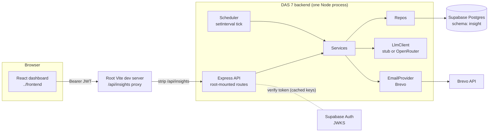
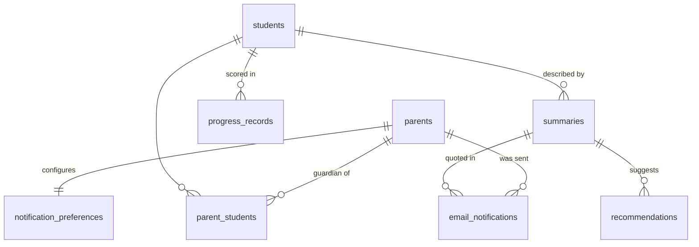

# DAS 7 Backend Architecture — Parent Insight Dashboard

> **Status:** describes the service as built and running. Design settled 2026-07-28; all six root migrations were applied to the ESC Supabase project on 2026-08-11. The first five provide the shared insight/worksheet foundation, while `0006_public_responses.sql` provisions DAS1's public response table. Where a decision has a condition that ought to force a rethink, that trigger is recorded inline rather than left implicit.

## 1. What this service does

DAS 7 is the **Parent Insight Dashboard** microservice for the Dyslexia Association of Singapore (DAS) platform. It lets a parent:

1. **Track progress** — view their child's scores over time across six literacy skill areas.
2. **Read summaries** — AI-generated, parent-friendly prose describing how the child is doing.
3. **Get recommendations** — AI-generated suggestions for how to support the child at home.
4. **Receive email updates** — periodic summary emails (weekly / fortnightly / monthly), controlled by a notification preference.

The dashboard UI lives in `../frontend` (React + Vite). This backend serves it a small JSON API and runs a background timer that sends the emails.

## 2. Design stance: deliberately simple

The service is three layers deep and abstracts only what is genuinely swappable:

- The **LLM provider** (OpenRouter today, stub offline) → behind an interface.
- The **email provider** (Brevo today) → behind an interface.

Everything else — Express, Supabase, the domain types — is a fixed decision, and abstracting a fixed decision is cost without payoff.

An earlier iteration of this service put a five-layer hexagonal architecture, a DI container, idempotency records, audit events, notification-job leases and transaction managers over the same six endpoints. The structure described here is the deliberate reaction to that, and the table below records what was dropped, so that each exclusion stays a decision someone can argue with rather than an oversight.

**Deliberately excluded** (and why it's safe to exclude them):

| Excluded | Why |
|---|---|
| `audit_events` table | Nothing reads it; no requirement asks for auditing. Console logs suffice. |
| `idempotency_records` | The only POST creates a recommendation; a duplicate row is harmless and the frontend doesn't retry. |
| `notification_jobs` + worker leases | Job tables coordinate multiple workers. We run one process; "who is due for an email" is *computed* from data on every tick, so a missed tick self-heals. |
| DI container | A plain `Deps` object built in `index.ts` and passed to `createApp()` gives the same test-swappability. |
| zod / validation library | Exactly one request body exists in the whole API; it is validated by hand. |
| Email provider SDK | Sending an email is one `fetch` call. |

Runtime dependencies, in full: `express` (v5), `@supabase/supabase-js`, `jose` (JWT verification), `dotenv`. Development: TypeScript, Jest + ts-jest, Supertest, `tsx` (runs `scripts/seed.ts` and the dev server without a build step), `cross-env`.

## 3. The big picture



- **One process** runs both the HTTP API and the notification scheduler. There is no separate worker deployment.
- DAS7 runs directly on the host at `localhost:4000`. The root Vite dev server is
  the sole browser-facing proxy: it routes `/api/insights/*` to DAS7 and strips
  that prefix, while the service mounts routes at the root (`/health`, `/me`,
  `/students/*`, `/parents/*`). Production hosting is outside this local setup.
- The database is the **centralized Supabase instance shared by all subsystems**. DAS 7 owns its own Postgres schema (`insight`) and never touches other services' schemas (schema-per-service rule from `OVERALL_ARCHITECTURE.md`).

## 4. Layers and directory structure

Three layers, one responsibility each:

- **Routes (controllers)** — parse the HTTP request, check authorization, call a service, wrap the result in the response envelope. No business logic.
- **Services (models)** — the business rules: staleness, error semantics, notification outcomes. These are the `TrackProgressModel` / `RecommendationModel` / `NotifierModel` boxes from the team's sequence diagrams. Unit-testable by injecting fake repos/adapters.
- **Repos + adapters** — repos hide supabase-js and the snake_case ⇄ camelCase mapping; adapters hide the LLM and email providers.

Data shapes (`Student`, `ProgressRecord`, …) are plain TypeScript interfaces in `src/types.ts`, mirroring the frontend's `src/types/domain.ts` — they carry no behavior. (TypeScript interfaces are erased at compile time; the *behavior* half of the class diagram's model classes lives in `services/`.)

```
backend/
├── package.json / tsconfig.json / tsconfig.build.json / jest.config.cjs
├── .env.example / Dockerfile / .dockerignore / README.md
├── scripts/seed.ts                         # demo parents/students/progress (service_role)
├── src/
│   ├── index.ts                # entrypoint: config → deps → createApp().listen → scheduler.start
│   │                           # also holds the two provider factories (§10)
│   ├── config.ts               # typed env parsing, fail-fast on missing vars
│   ├── deps.ts                 # the Deps object: every service/repo/adapter interface
│   ├── types.ts                # domain interfaces, mirror of frontend domain.ts
│   ├── errors.ts               # ApiError subclasses (§8)
│   ├── app.ts                  # createApp(deps): json parser, routes, error middleware
│   ├── http/
│   │   ├── envelope.ts         # {ok:true,data} | {ok:false,error} helpers
│   │   ├── auth.ts             # JWT middleware + requireOwnStudent / requireOwnParent
│   │   ├── error-handler.ts    # single error middleware + 404 catch-all
│   │   └── routes/
│   │       ├── health.routes.ts
│   │       ├── me.routes.ts
│   │       ├── students.routes.ts      # track-progress, summary, recommendations
│   │       └── preferences.routes.ts   # GET/PUT + inline body validation
│   ├── services/
│   │   ├── insight.service.ts      # ensureSummary, trackProgress, createRecommendation
│   │   ├── preference.service.ts
│   │   ├── notifier.service.ts     # notifyParent → 'parentNotified' | 'notificationFailed'
│   │   └── scheduler.ts            # setInterval wrapper: start/stop, never throws
│   ├── repos/
│   │   ├── db.ts                   # supabase client factory, scoped to the insight schema
│   │   ├── mappers.ts              # row ⇄ domain: snake_case → camelCase, six pure functions
│   │   ├── parent.repo.ts          # byAuthUserId, byId (+ studentIds)
│   │   ├── student.repo.ts         # byId, listByParent, isGuardian(parentId, studentId)
│   │   ├── progress.repo.ts        # listByStudent, latestCreatedAt
│   │   ├── summary.repo.ts         # latestByStudent, insert
│   │   ├── recommendation.repo.ts  # insert
│   │   ├── preference.repo.ts      # byParentId, upsert, listEnabled
│   │   └── emailNotification.repo.ts  # lastSentAt(parentId), insert
│   └── adapters/
│       ├── llm/
│       │   ├── llm-client.ts       # LlmClient interface + LlmUnavailableError
│       │   ├── stub-llm.ts         # deterministic offline stub (the test/demo default)
│       │   └── openrouter-llm.ts   # one fetch POST to openrouter.ai chat-completions
│       └── email/
│           ├── email-provider.ts   # EmailProvider interface + EmailSendError
│           ├── brevo-email.ts      # one fetch POST to api.brevo.com/v3/smtp/email
│           └── fake-email.ts       # public history[] + fail toggle (tests)
└── test/
    ├── unit/            # error-handler, mappers, auth, stub-llm, insight-service,
    │                    # preference-service, fake-email, notifier-service, scheduler
    ├── integration/     # track-progress, recommendations, auth, preferences, notifier
    └── helpers/         # harness.ts (test app + fixtures + skip guard), test-auth.ts (mints real JWTs)
```

The adapter files hold interfaces only. Both provider factories — "which LLM, which email sender" — live in `index.ts`, because choosing an implementation from config is composition, and composition happens in exactly one place (§10).

## 5. API contract

Defined by the mock frontend (`frontend/src/api/client.ts`, `summaryApi.ts`, `recommendationApi.ts`) — the backend must match it exactly.

**Every** response, including errors, uses the envelope:

```ts
{ ok: true,  data: T }        // success
{ ok: false, error: string }  // failure — error string is shown/logged by the UI
```

Paths below are the routes **as the service mounts them**. Browsers reach them through the root Vite proxy with `/api/insights` prepended (§3) — so `/me` here is `GET /api/insights/me` from the frontend.

| # | Method | Path | Returns (`data`) |
|---|---|---|---|
| 1 | GET | `/health` | `{ ok: true }` |
| 2 | GET | `/me` | `{ parent: Parent, students: Student[] }` — resolved from the JWT, *not* from a query param |
| 3 | GET | `/students/:studentId/track-progress` | `{ progress: ProgressRecord[], summary: Summary }` |
| 4 | GET | `/students/:studentId/summary` | `Summary` |
| 5 | POST | `/students/:studentId/recommendations` (no body) | `Recommendation` |
| 6 | GET | `/parents/:parentId/preferences` | `NotificationPreference` |
| 7 | PUT | `/parents/:parentId/preferences` | `NotificationPreference` |

PUT body (the only request body in the API): `{ enabled: boolean, frequency: 'Weekly'|'Fortnightly'|'Monthly', recipientEmail: string }`.

Contract details the frontend depends on:

- `ProgressRecord.date` and `Student.dateOfBirth` are **bare `YYYY-MM-DD` strings** (not ISO datetimes) — the chart parses them as `${date}T00:00:00`.
- `skillArea` is one of six exact strings: `Phonological Awareness`, `Reading Accuracy`, `Reading Fluency`, `Spelling`, `Writing`, `Comprehension`. Unknown values silently vanish from the chart.
- `score` is 0–100 (the chart's Y axis is fixed to that domain).
- `Recommendation.content` is a single string with `\n`-separated lines; it is keyed to a `summaryId`, not directly to the student.
- `Summary.generatedAt` / `Recommendation.generatedAt` are full ISO 8601 datetimes.

There is **no REST endpoint for notifications** — that flow is timer-driven (§7). There are also no login/signup/refresh endpoints — Supabase Auth owns those; the frontend will talk to Supabase directly with `supabase-js`.

## 6. Authentication and authorization

**Authentication** (who are you?) — every route except `/health`:

1. Read `Authorization: Bearer <token>`. Missing or malformed → **401**.
2. Verify the JWT locally with `jose`: `jwtVerify(token, key, { issuer: SUPABASE_URL + '/auth/v1' })`. Invalid/expired token → **401**, and the reason is never disclosed to the caller.

   Verification is asymmetric against the JWKS (Supabase's public signing keys, from `<SUPABASE_URL>/auth/v1/.well-known/jwks.json`), fetched via `createRemoteJWKSet` and cached in memory — re-fetched only if an unknown key id appears (key rotation). There is **no network call per request**. Audience is deliberately not checked: Supabase issues `aud: 'authenticated'` for every user, so it distinguishes nothing here; ownership is decided by the parent row in step 3.
3. Map the token's `sub` claim (the Supabase Auth user id) to a row in `insight.parents` via `auth_user_id`. No row → **403** (a valid platform user in the wrong group).
4. Attach the parent to the request (`req.parent`).

**Authorization** (may you see this?) — enforced in backend code:

- `requireOwnStudent(req, studentId)` — checks `parent_students` for the (caller, student) pair. **No row → 404 `progressUnavailable`.** By construction, a student that doesn't exist and a student that belongs to someone else produce the *same* query miss and the *same* error — a caller cannot probe which student ids exist.
- `requireOwnParent(req, parentId)` — preferences routes; a mismatched `parentId` → **404**. This closes the IDOR that exists in the mock backend (which accepts any `parentId`).

### 6.1 Database access model: service_role now, RLS later

**Decision (2026-07-28):** the backend talks to Supabase with the **`service_role` key**, scoped to the `insight` schema (`createClient(url, serviceKey, { db: { schema: 'insight' } })`). The `service_role` key bypasses Postgres Row Level Security entirely, so **all access control lives in the backend code** — which is why the two `requireOwn*` checks above are mandatory on every data route, and why the key must never leave the server (never in the frontend, never in git).

**Why:** only this backend touches `insight` tables; RLS policies on the shared instance would be extra design/maintenance for a second line of defense nothing else needs yet. Simpler wins at this scale.

**Future migration path to RLS** (record kept per team decision — do these if the trust model changes, e.g. the frontend starts querying Supabase directly, or defense-in-depth is wanted):

1. **Per-request client:** in request handling, build a Supabase client with the **anon key** plus the caller's JWT forwarded (`global: { headers: { Authorization: req.headers.authorization } }`), and use it in the repos. Postgres then knows who `auth.uid()` is.
2. **RLS policies per table:** `parents` → `auth_user_id = auth.uid()`; student-linked tables (`students`, `progress_records`, `summaries`, `recommendations` via join) → `EXISTS (SELECT 1 FROM insight.parent_students ps JOIN insight.parents p USING (parent_id) WHERE p.auth_user_id = auth.uid() AND ps.student_id = <row's student>)`; `notification_preferences` / `email_notifications` → owner-parent check.
3. **Grants:** `GRANT USAGE ON SCHEMA insight TO authenticated;` plus table-level selects/updates as needed.
4. **service_role remains** only where there is no user in context: the notification scheduler and the seed script.
5. The code-level `requireOwn*` checks **stay** — RLS becomes the second layer, not a replacement.

## 7. Core behaviors

### 7.1 Summaries (`insight.service.ts` — `ensureSummary`)

Shared by track-progress and summary routes (Get Summary is an `<<include>>` of Track Progress in the use-case model):

1. Verify guardianship (route already did). Load the student's progress records. **Zero records → 503 `progressUnavailable`** (IT7A-05).
2. Load the latest stored summary.
3. **Staleness rule:** regenerate **iff** there is no summary, or `max(progress_records.created_at) > summary.generated_at`. The comparison uses the internal `created_at` insertion timestamp, not the business `date`, so a *backdated* record still triggers regeneration. Otherwise **reuse** the stored summary — no LLM call, fast and deterministic.
4. On regeneration, call the LLM. **Failure → 503 `summaryUnavailable`, and nothing is stored** — the insert happens strictly after a successful generation, so "nothing stored on failure" (IT7A-07) is guaranteed by ordering; no transaction machinery needed.
5. **Concurrency stance:** two simultaneous stale requests may both generate and insert. This is accepted rather than prevented — reads always take the latest row, so the loser of the race is simply an extra row nobody reads, and provoking it requires a double-click during generation. Locking or coalescing would cost more machinery than the duplicate row costs.

### 7.2 Recommendations (`createRecommendation`)

Guardianship → load the **latest stored summary**. None → **404 `summaryUnavailable`** (IT7A-08). Call the LLM; failure → **503 `recommendationUnavailable`, nothing stored** (IT7A-09). Success → insert keyed on `summary_id`, return. This flow never triggers summary generation — the recommendation button lives on a page that has already loaded the summary.

### 7.3 Notifications (`notifier.service.ts` + `scheduler.ts`)

The "Notify Parent" flow (sequence diagram 7_2) is **not an HTTP flow** — its outcomes are return values, not status codes, matching the IT7B test cases:

- `notifyParent(parentId, now)` → `'parentNotified' | 'notificationFailed'`
  1. Load the parent's notification preference; must be `enabled`.
  2. Load the parent's students; for each, run `ensureSummary` (§7.1) — fresh summaries get generated *and stored* (IT7B-03).
  3. Compose one email (subject like "Progress update for <names>", body from the summaries).
  4. `emailProvider.send(...)`, **then** insert the `email_notifications` row. Because the send precedes the insert, a failed send leaves no row — "email not recorded" (IT7B-02/04) is again pure ordering.
  5. Any failure anywhere (no progress → IT7B-05, LLM down → IT7B-04, provider unreachable → IT7B-02) is caught, logged, and returned as `'notificationFailed'`. Nothing escapes to crash the tick.
- `runDueNotifications(now)` — selects enabled preferences; a parent is **due** iff `lastSent === null || now − lastSent ≥ interval(frequency)`, where `lastSent` is the newest `email_notifications.sent_at` for that parent. Intervals: Weekly = 7 d, Fortnightly = 14 d, Monthly = 30 d — each overridable via env (`NOTIFY_WEEKLY_MS` etc.) so a live demo can set Weekly = 60 s and watch an email arrive.

**Scheduler:** an in-process `setInterval` (default tick 15 min, `SCHEDULER_TICK_MS`) calling `runDueNotifications`, started from `index.ts` when `SCHEDULER_ENABLED=true`, with `start()`/`stop()` and a catch that never lets an error escape.

*Why in-process rather than a separate worker:* one host process and one `.env`; the volume is tiny; due-ness is computed per tick, so a crash just delays work to the next tick; and a separate process would need exactly the job-lease coordination machinery this design deleted. **Revisit trigger:** running multiple API replicas (they would double-send) — that's the point to split the scheduler out or add a job table.

## 8. Error model

Small typed hierarchy in `src/errors.ts`; one Express error middleware maps them to the envelope. Express 5 forwards rejected async handlers automatically, so services simply `throw`.

| Class | Status | `error` strings used |
|---|---|---|
| `UnauthorizedError` | 401 | `unauthorised` |
| `ForbiddenError` | 403 | `forbidden` |
| `NotFoundError` | 404 | `progressUnavailable` (missing/unowned student), `summaryUnavailable` (no summary for recommendations), `notFound` (catch-all route, unknown parent) |
| `ValidationError` | 400 | human-readable, e.g. `` `frequency` must be one of: Weekly, Fortnightly, Monthly.`` |
| `UnavailableError` | 503 | `authUnavailable` (JWKS unavailable), `progressUnavailable` (no records), `summaryUnavailable` (LLM failed), `recommendationUnavailable` (LLM failed) |
| anything else | 500 | `internalError` (real error logged server-side only) |

## 9. Database schema — `insight` on the shared Supabase

**Applied state (2026-08-11):** all six root migrations are live on the ESC project (`vhppezszezjppgoqhbpf`). Migrations `0001_insight_schema.sql` through `0005_parent_auth_user_constraint.sql` provide the insight/worksheet foundation; `0006_public_responses.sql` provisions DAS1's public response table. The `insight` schema has its eight tables, service-role-only grants, RLS enabled with no policies, and required Auth-backed parent profiles. The shared [`db/migrations/README.md`](../../../db/migrations/README.md) history is the authoritative record; this section describes what the initial DAS7 files create.

The ESC Data API exposes the `insight` and `worksheet` schemas. Browser `anon` and
`authenticated` roles remain denied by the migrations' grants and RLS, while the
server-side service-role clients use the exposed schemas. This retains backend-owned
access without treating schema exposure as browser access (§9.3).

### 9.1 Tables at a glance

Eight tables, all in schema `insight`. Every primary key is a `uuid` defaulting to `gen_random_uuid()`; every foreign key to a parent/student is `on delete cascade`, so deleting one parent row cleans up everything hanging off it (relied on by the integration-test teardown, §11).



**`parents`** — one row per registered parent. The bridge between Supabase Auth and this service.

| Column | Type | Notes |
|---|---|---|
| `parent_id` | uuid PK | |
| `auth_user_id` | uuid unique, not null, FK → `auth.users.id` | The Supabase Auth user id (JWT `sub`). `0005_parent_auth_user_constraint.sql` adds the required Auth foreign key with `on delete cascade`. |
| `name` | text not null | |
| `email` | text not null | Account email. The address emails actually go to is `notification_preferences.recipient_email`. |
| `mobile_number` | text not null default `''` | Carried for parity with the frontend `Parent` type; unused by any flow. |

**`students`** — one row per child.

| Column | Type | Notes |
|---|---|---|
| `student_id` | uuid PK | |
| `name` | text not null | |
| `date_of_birth` | date | Serialized as a bare `YYYY-MM-DD` string, per the API contract (§5). |
| `band_level` | text not null | Free text (e.g. `Band 2`); no check constraint — the frontend only displays it. |

**`parent_students`** — the guardianship join table, and the **sole basis for authorization** (§6). A missing row is what turns into `404 progressUnavailable`.

| Column | Type | Notes |
|---|---|---|
| `parent_id` | uuid → `parents` | Composite PK part 1 |
| `student_id` | uuid → `students` | Composite PK part 2 |

The composite primary key makes a duplicate link impossible and gives the lookup its index for free. Many-to-many by design: two guardians may share a child, one guardian may have several.

**`progress_records`** — the raw data behind the chart and every generated summary.

| Column | Type | Notes |
|---|---|---|
| `record_id` | uuid PK | |
| `student_id` | uuid → `students` | |
| `date` | date not null | The **business** date of the assessment; may be backdated. |
| `skill_area` | text not null | `check` constrained to the six exact strings in §5 — the database, not just the code, rejects a seventh skill area (which would silently vanish from the chart). |
| `score` | int not null | `check (score between 0 and 100)`, matching the chart's fixed Y axis. |
| `notes` | text not null default `''` | |
| `created_at` | timestamptz not null default `now()` | **Internal insertion time, never exposed.** `max(created_at)` vs `summaries.generated_at` is the staleness rule (§7.1) — using this rather than `date` is what makes a backdated record still trigger regeneration. |

Index `progress_records_student_date_idx (student_id, date)` — the list-by-student read, already in chart order.

**`summaries`** — append-only; rows are never updated, "the summary" always means the newest.

| Column | Type | Notes |
|---|---|---|
| `summary_id` | uuid PK | |
| `student_id` | uuid → `students` | |
| `content` | text not null | LLM prose. A row exists ⇒ generation succeeded (the insert follows a successful call), which is what makes "nothing stored on failure" (IT7A-07) pure ordering. |
| `generated_at` | timestamptz not null default `now()` | Full ISO 8601 datetime in the API. Compared against `progress_records.created_at` for staleness. |

Index `summaries_student_latest_idx (student_id, generated_at desc)` — serves the "latest summary" lookup that both the summary route and the recommendation flow depend on.

**`recommendations`** — append-only, keyed to a **summary**, not to a student.

| Column | Type | Notes |
|---|---|---|
| `recommendation_id` | uuid PK | |
| `summary_id` | uuid → `summaries` | No summary ⇒ no recommendation is possible; that's the `404 summaryUnavailable` in §7.2. |
| `content` | text not null | Newline-joined suggestion lines (one string, per the contract). |
| `generated_at` | timestamptz not null default `now()` | |

**`notification_preferences`** — exactly one row per parent, enforced by making `parent_id` the primary key *and* the foreign key. That is why the repo is an `upsert` rather than an insert/update pair.

| Column | Type | Notes |
|---|---|---|
| `parent_id` | uuid PK → `parents` | |
| `enabled` | boolean not null default `false` | Opt-in: a parent who never touched preferences is never emailed. |
| `frequency` | text not null default `'Weekly'` | `check` constrained to `Weekly` / `Fortnightly` / `Monthly` — the same three values the PUT body validator accepts, enforced twice on purpose. |
| `recipient_email` | text not null | Where the email goes; deliberately separate from `parents.email`. |

**`email_notifications`** — the send log. **A row exists ⇒ that email was sent**, because the insert happens strictly after `emailProvider.send()` returns (§7.3). This table is also the state the due-calculation reads, which is why no job table is needed.

| Column | Type | Notes |
|---|---|---|
| `notification_id` | uuid PK | |
| `parent_id` | uuid → `parents` | |
| `summary_id` | uuid → `summaries`, **nullable, no cascade** | Which summary the email quoted, when there was a single one. Nullable because a multi-child email quotes several. |
| `recipient_email` | text not null | Copy of the address at send time, not a live join — a later preference change must not rewrite history. |
| `subject` | text not null | |
| `body` | text not null | |
| `sent_at` | timestamptz not null default `now()` | Doubles as "last sent": `max(sent_at)` per parent is the input to `isDue` (§7.3). |

Index `email_notifications_parent_latest_idx (parent_id, sent_at desc)` — exactly the shape of that "newest send for this parent" query.

### 9.2 DDL ([`db/migrations/0001_insight_schema.sql`](../../../db/migrations/0001_insight_schema.sql))

Written idempotently throughout (`if not exists`), so re-running on an up-to-date database is harmless.

```sql
create schema if not exists insight;

create table if not exists insight.parents (
    parent_id     uuid primary key default gen_random_uuid(),
    auth_user_id  uuid unique,            -- Supabase Auth user id (JWT `sub`); nullable so
    name          text not null,          -- seed data can exist before the parent signs up
    email         text not null,
    mobile_number text not null default ''
);

create table if not exists insight.students (
    student_id    uuid primary key default gen_random_uuid(),
    name          text not null,
    date_of_birth date not null,
    band_level    text not null
);

create table if not exists insight.parent_students (   -- guardianship: who may see whom
    parent_id  uuid not null references insight.parents  on delete cascade,
    student_id uuid not null references insight.students on delete cascade,
    primary key (parent_id, student_id)
);

create table if not exists insight.progress_records (
    record_id  uuid primary key default gen_random_uuid(),
    student_id uuid not null references insight.students on delete cascade,
    date       date not null,                 -- bare business date, per API contract
    skill_area text not null check (skill_area in ('Phonological Awareness','Reading Accuracy',
                 'Reading Fluency','Spelling','Writing','Comprehension')),
    score      int  not null check (score between 0 and 100),
    notes      text not null default '',
    created_at timestamptz not null default now()   -- internal; drives staleness (§7.1)
);
create index if not exists progress_records_student_date_idx
    on insight.progress_records (student_id, date);

create table if not exists insight.summaries (
    summary_id   uuid primary key default gen_random_uuid(),
    student_id   uuid not null references insight.students on delete cascade,
    content      text not null,
    generated_at timestamptz not null default now()
);
create index if not exists summaries_student_latest_idx
    on insight.summaries (student_id, generated_at desc);   -- "latest summary"

create table if not exists insight.recommendations (
    recommendation_id uuid primary key default gen_random_uuid(),
    summary_id        uuid not null references insight.summaries on delete cascade,
    content           text not null,          -- newline-joined suggestion lines
    generated_at      timestamptz not null default now()
);

create table if not exists insight.notification_preferences (
    parent_id       uuid primary key references insight.parents on delete cascade,
    enabled         boolean not null default false,
    frequency       text not null default 'Weekly'
                      check (frequency in ('Weekly','Fortnightly','Monthly')),
    recipient_email text not null
);

create table if not exists insight.email_notifications (  -- a row exists ⇒ email was sent
    notification_id uuid primary key default gen_random_uuid(),
    parent_id       uuid not null references insight.parents on delete cascade,
    summary_id      uuid references insight.summaries,
    recipient_email text not null,
    subject         text not null,
    body            text not null,
    sent_at         timestamptz not null default now()  -- doubles as "last sent"
);
create index if not exists email_notifications_parent_latest_idx
    on insight.email_notifications (parent_id, sent_at desc);
```

### 9.3 Grants and RLS ([`db/migrations/0002_grants_and_rls.sql`](../../../db/migrations/0002_grants_and_rls.sql))

A schema you create yourself starts with **no privileges for anyone** — Supabase only wires privileges up automatically for `public`. Migration 0002 fixes that, and grants to `service_role` *only*: `anon` and `authenticated` deliberately get nothing, so the browser cannot reach these tables through the Data API even if schema exposure is later approved. All access goes through this backend.

```sql
grant usage on schema insight to service_role;
grant all privileges on all tables in schema insight to service_role;

-- Applies to tables created by later migrations, so this never has to be repeated.
alter default privileges in schema insight grant all on tables to service_role;

alter table insight.parents                  enable row level security;
alter table insight.students                 enable row level security;
alter table insight.parent_students          enable row level security;
alter table insight.progress_records         enable row level security;
alter table insight.summaries                enable row level security;
alter table insight.recommendations          enable row level security;
alter table insight.notification_preferences enable row level security;
alter table insight.email_notifications      enable row level security;
```

**RLS is enabled with no policies.** That is a no-op today — `service_role` bypasses RLS (§6.1) — but it **fails safe**: if anyone later grants access to `authenticated`, RLS-on-with-no-policies denies everything, whereas RLS-off-plus-grant would be wide open. Adding the real per-row policies is step 2 of the §6.1 migration path; the tables are already armed for them.

**Migration management:** numbered SQL files in the root [`db/migrations/`](../../../db/migrations/) directory are applied manually via the Supabase SQL editor by a human. Never renumber or rewrite an applied file; add a new one.

**Data provenance:** progress data is **seeded** (`scripts/seed.ts`) this iteration — no live ingestion from other subsystems. If DAS 7 later needs real assessment data, the platform rule is to call the owning service's API (e.g. `GET /api/screening/results/{childId}`), never to read another service's tables.

## 10. Adapters

### 10.1 LLM (`src/adapters/llm/`)

Provider is **undecided**; the seam is one interface:

```ts
interface LlmClient {
  generateSummary(input: { student: Student; records: ProgressRecord[] }): Promise<string>;
  generateRecommendation(input: { student: Student; summary: Summary }): Promise<string>; // '\n'-joined lines
}
class LlmUnavailableError extends Error {}   // any failure mode: down, timeout, malformed output
```

`createLlmClient(config)` in `index.ts` switches on `LLM_PROVIDER`. Two cases are implemented — `stub` (the default) and `openrouter`; `anthropic`, `openai` and `gemini` are accepted config values with no adapter yet, and throw at startup naming the provider and pointing back at this section. Selecting `openrouter` without `LLM_API_KEY` or `LLM_MODEL` throws too, naming whichever is missing. Failing at startup rather than on the first request is the point — a misconfigured provider is a deploy-time mistake, and it should not wait hours to surface as a 503.

**Adding a further provider = one new file implementing the interface + one switch case + env keys** (`LLM_API_KEY`, `LLM_MODEL`, `LLM_TIMEOUT_MS` with `AbortSignal.timeout`). Output validation (non-empty, length caps, line structure for recommendations) belongs in the real adapter; anything malformed → `LlmUnavailableError`.

**Why OpenRouter as the first real provider.** It fronts every major vendor behind one OpenAI-compatible endpoint, so a single adapter reaches all of them and changing model is an `.env` edit rather than new code — useful while the team is still comparing models, and it keeps one account and one key instead of several. `createOpenRouterLlmClient` is one `fetch` to `/api/v1/chat/completions`, no SDK, with system prompts that forbid markdown and medical advice, a `max_tokens` cap, a length cap on summaries, and bullet/numbering stripping on recommendations so the `'\n'`-joined-lines contract holds even when a model ignores the instruction. **Costs:** an extra network hop, and free (`:free`) models are rate-limited and can queue — raise `LLM_TIMEOUT_MS` accordingly and expect the 503 path to be exercised for real. **Privacy:** progress data passes through OpenRouter *and* the upstream vendor; the prompt sends first names only, no date of birth and no identifiers.

`StubLlmClient` is **deterministic** — it computes per-skill-area averages and trends from the actual input (e.g. "Reading Fluency improved from 62 to 78 across 3 sessions"), so demo output looks plausible and unit tests can assert exact strings.

### 10.2 Email (`src/adapters/email/`)

```ts
interface SentEmail { to: string; subject: string; body: string; }
interface EmailProvider { send(email: SentEmail): Promise<void>; }  // throws EmailSendError
```

- `createBrevoEmailProvider` — one `fetch` POST to `https://api.brevo.com/v3/smtp/email` with an `api-key` header, a 10s `AbortSignal.timeout`, and no retries; non-2xx or network error → `EmailSendError`. No SDK, and the key never appears in a thrown message.
- `FakeEmailProvider` — public `history: SentEmail[]` and a fail toggle. The IT7B tests assert directly against `history` ("EmailProvider has the email in its history").

The factory sits in `index.ts` alongside the LLM one. Selecting `brevo` requires both `BREVO_API_KEY` and `EMAIL_FROM`; whichever is missing is named in a startup error. Selecting `fake` logs a warning at startup, because a service that silently records mail in memory instead of delivering it is worth one noisy line in the log.

**Why Brevo and not Resend.** The service originally used Resend. Its free tier without a verified domain only delivers to the account owner's own address, which makes it impossible to email a real parent — or a teammate during a demo. Brevo lifts that restriction once a **single sender address** is verified (Senders & IPs → Senders), with no domain ownership required, at 300 emails/day. The swap cost one adapter file and one factory case, which is the seam working as intended. **Revisit trigger:** if the team acquires a domain, verifying it in any provider improves deliverability and removes the per-address verification step.

## 11. Testing strategy → IT7x mapping

Unit tests run offline. Integration tests use the **real Supabase** (real repos, real routes, real JWT verification) and stub **exactly two boundaries**, as the PM3 test plan specifies: the LLM client and the email provider.

| Jest suite | Kind | Covers |
|---|---|---|
| `unit/insight-service.test.ts` | unit | §7.1 regenerate/reuse rule + IT7A error semantics |
| `unit/stub-llm.test.ts` | unit | stub determinism |
| `unit/notifier-service.test.ts`, `unit/scheduler.test.ts` | unit | due calculation (`isDue`), outcomes, timer behavior |
| `unit/preference-service.test.ts` | unit | defaults + 400 messages |
| `unit/error-handler.test.ts`, `unit/mappers.test.ts`, `unit/auth.test.ts`, `unit/fake-email.test.ts` | unit | envelope mapping/500, row⇄domain mapping, JWT middleware paths, fake provider |
| `integration/track-progress.int.test.ts` | integration | IT7A-01, 02, 04, 05, 07 |
| `integration/recommendations.int.test.ts` | integration | IT7A-03, 08, 09 |
| `integration/auth.int.test.ts` | integration | IT7A-06 — no/garbage token → 401; parent A requesting parent B's student → 404 |
| `integration/preferences.int.test.ts` | integration | preferences 200/400/404 + cross-parent 404 |
| `integration/notifier.int.test.ts` | integration | IT7B-01…05 (call `notifyParent` directly; fake email, failable LLM); IT7B-06 (scheduler tick via Jest fake timers → `parentNotified`) |

Harness notes:

- **Real JWTs, no forgery:** global setup signs in two pre-created Supabase Auth test users (parent A and parent B) with `signInWithPassword` using the anon key; tests use the real tokens through the real JWKS verification path.
- **Teardown:** tests insert rows with fresh UUIDs and delete the test parents in `afterAll` — `on delete cascade` cleans the rest. Deletes work despite the grant-only-`service_role` setup in §9.3 for the same reason RLS is a no-op today: the `service_role` key bypasses both.
- **Not fully isolated, deliberately.** `runDueNotifications` sweeps *every* enabled preference in the project, so the notifier suite also generates summaries and `email_notifications` rows for the seeded demo parent. That is inherent to testing a sweep rather than a single call, so the suite asserts by recipient address instead of by row count.
- **Safety guard:** integration suites refuse to run unless `SUPABASE_URL` contains the project ref in `TEST_SUPABASE_REF`, preventing an accidental run against the wrong project.
- IT7B outcomes are asserted as **return values** (`parentNotified` / `notificationFailed`), not HTTP statuses — the PM3 tables list statuses for 7B, but the flow has no HTTP surface; this correction is deliberate and matches the sequence diagram's own message names.

## 12. Configuration (`.env`)

| Variable | Purpose |
|---|---|
| `NODE_ENV`, `PORT` | standard; port 4000 (frontend dev proxy target) |
| `SUPABASE_URL` | `https://<project-ref>.supabase.co` |
| `SUPABASE_SERVICE_ROLE_KEY` | server-only secret — never in frontend or git |
| `SUPABASE_DB_SCHEMA` | `insight` |
| `SUPABASE_JWKS_URL` | optional override; defaults to `${SUPABASE_URL}/auth/v1/.well-known/jwks.json` |
| `SEED_AUTH_USER_ID` | `scripts/seed.ts` only — required Auth user ID for the demo parent. Use a *third* Auth user, not either `TEST_USER_*`: the integration harness owns those two parent rows and refuses to run if it finds one mapped to a parent it did not create. |
| `LLM_PROVIDER` | `stub` (default) \| `openrouter`; `anthropic` \| `openai` \| `gemini` are accepted but unimplemented |
| `LLM_API_KEY`, `LLM_MODEL`, `LLM_TIMEOUT_MS` | required by `openrouter`; model ids are `vendor/model`, e.g. `google/gemini-2.0-flash-exp:free` |
| `EMAIL_PROVIDER` | `brevo` \| `fake` |
| `BREVO_API_KEY`, `EMAIL_FROM` | Brevo API key and a sender address verified in Brevo |
| `SCHEDULER_ENABLED`, `SCHEDULER_TICK_MS` | notification timer (default tick 15 min) |
| `NOTIFY_WEEKLY_MS`, `NOTIFY_FORTNIGHTLY_MS`, `NOTIFY_MONTHLY_MS` | demo overrides; blank = 7/14/30 days |
| `SUPABASE_ANON_KEY` | tests only — mint real JWTs via `signInWithPassword` |
| `TEST_SUPABASE_REF` | tests only — safety guard (§11) |
| `TEST_USER_A_EMAIL/PASSWORD`, `TEST_USER_B_*` | tests only — pre-created auth users |

## 13. Runtime

One host process serves the API and runs the notification timer. DAS7 is not part
of the DAS3 Docker stack.

- **Startup** builds everything once at module scope in `index.ts`: config → Supabase client → the seven repos → LLM and email adapters → the three services → `Deps` → `createApp()`. A missing or contradictory environment variable fails here, not on the first request that needs it.
- **Binding** is `0.0.0.0:4000`, which lets the root Vite proxy reach the host service. The startup log is one line naming the schema and selected providers.
- **Shutdown** on `SIGINT`/`SIGTERM` stops the scheduler, then closes the server, then exits cleanly.
- **Node 22 or newer is required.** `@supabase/supabase-js` reaches for a native `WebSocket` during `createClient()`, which Node 20 does not provide.

## 14. Glossary (for non-backend readers)

- **JWT (JSON Web Token):** a signed token the browser sends with each request proving who the user is. We verify the signature locally against Supabase's published public keys (**JWKS**), so no network call is needed per request.
- **service_role key:** Supabase's all-powerful server key. It skips all database-level security, which is why it must stay server-side and why the backend re-checks permissions in code.
- **RLS (Row Level Security):** Postgres feature where the database itself filters rows per user. We don't use it yet — see §6.1 for the migration path.
- **Adapter:** a thin wrapper class that hides an external service (LLM, email) behind a small interface, so tests can swap in a fake and the provider can change without touching business logic.
- **Repo(sitory):** a module that owns all database queries for one table, translating between DB rows (snake_case) and domain objects (camelCase).
- **Envelope:** the `{ok, data} / {ok, error}` wrapper every API response uses, so the frontend has one uniform way to detect errors.
- **Idempotent (migrations):** written so running the same SQL twice is harmless (`create table if not exists`).
- **IDOR (Insecure Direct Object Reference):** the vulnerability where guessing someone else's id in a URL exposes their data — prevented here by the guardianship checks in §6.
