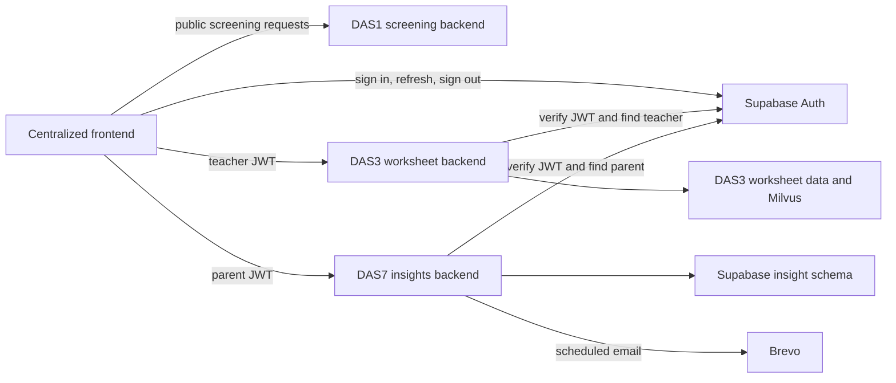
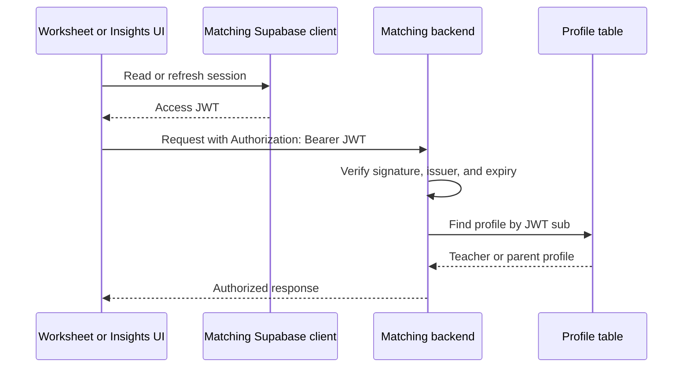

# System architecture

This document describes the target architecture. For the gap between this design
and the current code, see [integration/README.md](integration/README.md).

## Scope

The repository contains one browser application and three independent services.
The centralized frontend gives users one entry point, but it does not merge the
backend code or data access.



The arrows show ownership. Screening pages call DAS1, worksheet pages call DAS3,
and insight pages call DAS7. One service must not act as an informal gateway to
another service.

## Components

### Centralized frontend

The root `frontend/` directory is the browser application. It owns the homepage,
shared navigation, route guards, and the three service-specific API clients.

| Route | Access | Backend |
| --- | --- | --- |
| `/` | Public | None |
| `/screening/*` | Public | DAS1 |
| `/worksheet/login` | Public login page | Supabase Auth |
| `/worksheet/*` | Teachers | DAS3 |
| `/insights/login` | Public login page | Supabase Auth |
| `/insights/*` | Parents | DAS7 |

The frontend may use the Supabase client for authentication. It must not use the
Supabase Data API for worksheet or insight records. Those requests belong to the
backends.

### DAS1 screening

DAS1 is public and does not read a Supabase login session. A generated screening
session identifier identifies the current screening flow, but it is not proof of
identity. Any future staff dashboard or private results endpoint will need its own
authorization design.

Public API prefix: `/api/screening`

### DAS3 worksheet

DAS3 is for teachers. Its LangGraph backend owns worksheet generation, retrieval,
and worksheet data. Before it is exposed through the centralized frontend, it must
verify Supabase JWTs and confirm that `sub` belongs to a teacher profile.

Public API prefix: `/api/worksheet`

### DAS7 insights

DAS7 is for parents. Its Express backend verifies Supabase JWTs, maps `sub` to the
parent profile, and checks that the parent owns the requested student record. It
also owns summaries, recommendations, notification preferences, and scheduled
email delivery.

Public API prefix: `/api/insights`

Brevo remains the production email provider. The fake provider is for development
and tests.

## Authentication model

### One user pool, two account groups

DAS3 and DAS7 share one Supabase project and its managed `auth.users` table. The
project does not create separate password tables. Application tables link a user
ID to one account group:

- The DAS3 teacher profile table is owned by the worksheet service.
- The existing DAS7 parent profile is `insight.parents`, linked through
  `auth_user_id`.

An account belongs to exactly one group. Administrators create or invite accounts
and add the matching profile. Provisioning must reject an auth user ID that is
already assigned to the other group.

This is logical separation inside one Supabase project. A backend service-role key
can bypass RLS and may have access to more than one schema, so it does not provide
credential-level isolation between DAS3 and DAS7. Each backend must keep the key in
its environment file and limit its repository code to the tables it owns. If the
project later needs strict credential isolation, use separate Supabase projects or
dedicated database roles.

### Independent browser sessions

The frontend creates two Supabase client instances with different auth storage
keys. Both clients use the same Supabase URL and publishable key.

| Client | Session | Used by |
| --- | --- | --- |
| Worksheet auth client | Teacher account | `/worksheet/*` and DAS3 API client |
| Insights auth client | Parent account | `/insights/*` and DAS7 API client |

This lets one browser hold a teacher session and a parent session at the same time.
Each logout action uses the matching client and local sign-out scope. Logging out
of one service must leave the other session intact.

Because both account groups share one Supabase user pool, one email address maps to
one auth account. A person who needs two separate accounts must use two email
addresses under this design.

### Protected request flow



The frontend route guard can hide pages from the wrong account group, but it is not
an authorization boundary. The backend performs the final check on every protected
request.

Do not use user-editable `user_metadata` for authorization. The current design
uses a profile lookup because it is simpler than adding custom JWT claims and token
hooks.

## API and error rules

The frontend keeps three base URLs:

```dotenv
VITE_DAS1_API_URL=/api/screening
VITE_DAS3_API_URL=/api/worksheet
VITE_DAS7_API_URL=/api/insights
```

These values are the target frontend convention. They may be relative prefixes or
full backend URLs, depending on deployment. Each API client must read only its own
value and, for protected services, only its own auth session.

Protected backends use these status codes:

| Status | Meaning | Frontend behavior |
| --- | --- | --- |
| `401 Unauthorized` | Token is missing, expired, malformed, or invalid | Show the matching login page |
| `403 Forbidden` | Token is valid but the account belongs to the wrong group | Show access denied |
| `404 Not Found` | Record is absent or is not owned by this user | Show a generic not found message |

Returning `404` for both a missing record and another user's record prevents ID
probing from revealing whether a student or parent exists. Login errors must not
reveal whether an email address is registered.

See [../API_CONTRACTS.md](../API_CONTRACTS.md) for transport and response details.

## Development and production routing

The root Vite server currently proxies all three API prefixes and removes the
prefix before forwarding. The browser sees requests to its own origin, so local
development does not need CORS.

Vite's development proxy is not part of a production build. Production must use
one of these options:

1. Configure the hosting platform to proxy the same `/api/*` prefixes.
2. Point the frontend at separate backend URLs and allow the deployed frontend
   origin through CORS on each backend.

If separate URLs are used, the CORS allowlist should contain the exact frontend
origin. Protected backends should not use a wildcard origin.

## Deployment model

The frontend and three backends run as four processes. They can be deployed and
updated separately. Docker and Traefik are not part of this target. Existing
container files remain in the repository until the team verifies the replacement
deployment and chooses whether to remove them.

Configuration comes from environment files or the deployment platform's secret
store. Real Supabase service-role, LLM, and Brevo keys must never appear in the
frontend or a committed file.

## Ownership summary

| Area | Owner |
| --- | --- |
| Homepage, routes, route guards, browser sessions | Centralized frontend |
| Public screening flow | DAS1 backend |
| Teacher authorization and worksheets | DAS3 backend |
| Parent authorization, insights, preferences, email scheduling | DAS7 backend |
| Credentials and session issuance | Supabase Auth |
| Production email delivery | Brevo |

The service owner is responsible for its API contract, tests, and data access. A
frontend change that crosses a service boundary should use that service's API
client rather than importing another service's internal types or database code.

## Supabase references

- [User management and profile tables](https://supabase.com/docs/guides/auth/managing-user-data)
- [JavaScript client initialization and session storage](https://supabase.com/docs/reference/javascript/initializing)
- [Local and global sign-out scopes](https://supabase.com/docs/reference/javascript/auth-signout)
